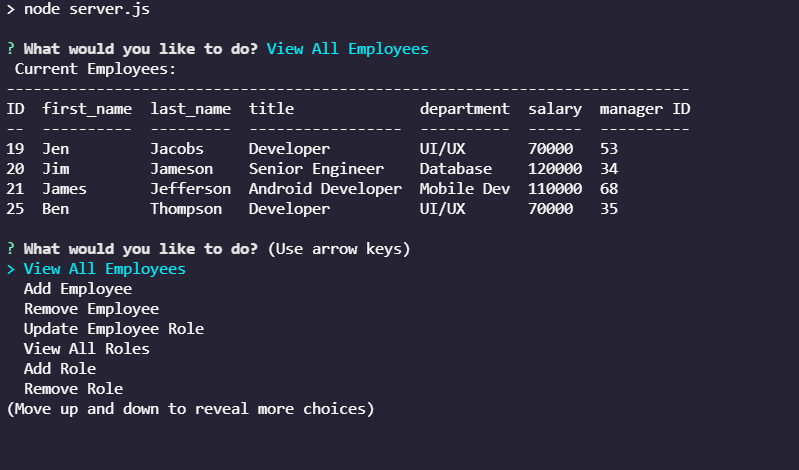

# Employee Tracker

## Description

Do you need a better way to track your employees?

This employee tracker will allow you to keep track of your company. Departments can be added, deleted, and viewed. Roles can be added, deleted, and viewed. Employees can also be added, deleted, and viewed. You will also be able to update your employee's role with ease when it's time for your staff to get that promotion.

Manage your employees with simplicity and ease!

This employee tracker was written in JavaScript using Express.js, Node.js, Inquirer, Console.table, and MySQL.

## Table of Contents

* [Description](#description)
* [Installation](#installation)
* [Usage](#usage)
* [Credits](#credits)
* [License](#license)

## Installation

To install the application's dependencies, type the following:
```md
npm install
```
Put the schema into your MySQL Workbench, then seed the database.

To run the application, type the following:
```md
npm start
```
Once those steps are done, you can view the application in your terminal.

## Usage

Navigate to [Sarah Mäkelä's video](https://youtu.be/vBxUq7Q1XxA) to view the application's functionality.



## Credits

Created by [Sarah Mäkelä](https://github.com/smakela13).

## License

This website currently has No License, which means it is under exclusive copyright. No one can copy, distribute, or modify this website without permission.